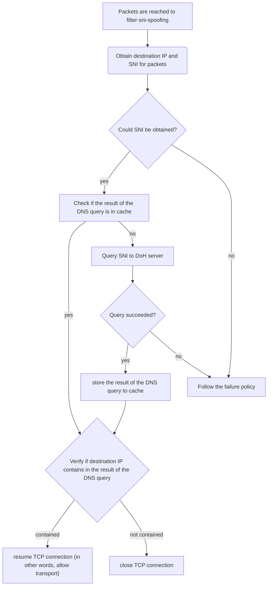

# filter-sni-spoofing

filter-sni-snooping is Proxy-Wasm filter to deny packets if destination IP address is not matched to the address resolved from SNI.

## Background / Motivation

[Envoy](https://github.com/envoyproxy/envoy) can be configured as follows to provide a Transparent Proxy that only allows communication to a specific destination (`s1.local` in the following case).

<details><summary>envoy.yaml</summary>

```yaml
static_resources:
  listeners:
    - name: listener_transparent
      address:
        socket_address:
          address: 0.0.0.0
          port_value: 15001 # packets will be redirected by iptables
      listener_filters:
        - name: envoy.filters.listener.tls_inspector
          typed_config:
            "@type": type.googleapis.com/envoy.extensions.filters.listener.tls_inspector.v3.TlsInspector
        - name: envoy.filters.listener.original_dst
          typed_config:
            "@type": type.googleapis.com/envoy.extensions.filters.listener.original_dst.v3.OriginalDst
      filter_chains:
        - filter_chain_match:
            server_names:
              - "s1.local"
          filters:
            - name: envoy.filters.network.tcp_proxy
              typed_config:
                "@type": type.googleapis.com/envoy.extensions.filters.network.tcp_proxy.v3.TcpProxy
                stat_prefix: tcp
                cluster: original-destination
                access_log:
                  - name: envoy.access_loggers.stdout
                    typed_config:
                      "@type": type.googleapis.com/envoy.extensions.access_loggers.stream.v3.StdoutAccessLog
        - filters:
            - name: envoy.filters.network.tcp_proxy
              typed_config:
                "@type": type.googleapis.com/envoy.extensions.filters.network.tcp_proxy.v3.TcpProxy
                stat_prefix: reject
                cluster: blackhole

  clusters:
    - name: original-destination
      type: ORIGINAL_DST
      connect_timeout: 5s
      lb_policy: CLUSTER_PROVIDED
      upstream_connection_options:
        tcp_keepalive: {}

    - name: blackhole
      type: STATIC
      connect_timeout: 1s
      lb_policy: ROUND_ROBIN
      load_assignment:
        cluster_name: blackhole
        endpoints:
          - lb_endpoints:
              - endpoint:
                  address:
                    socket_address:
                      address: 127.0.0.1
                      port_value: 1  # Any port not listening
```

</details>

Envoy with the above configuration achieves filtering by evaluating the SNI of packets.

However, in this case, there is a problem that a malicious client can spoof the SNI and communicate to arbitrary destinations as shown below.

```bash
echo "1.2.3.4 s1.local" >> /etc/hosts
curl -k https://s1.local 
```

filter-sni-spoofing, which is the Proxy-Wasm filter, solves the above problem by resolving the SNI of the packet and denying one if it does not match the destination IP address.

## Usage

Confirmed to work only with Envoy.

Please refer the [envoy.yaml](./example/envoy/envoy.yaml) in example directory.

## How it works



### Request to DNS over HTTPS (DoH) Server
  
filter-sni-spoofing queries the DoH server for the A or AAAA record of the FQDN written in the SNI using `dispatch_http_call` ABI of Proxy-Wasm.

`dispatch_http_call` ABI must be specified the upstream name, which is the cluster name in Envoy configuration.
`dispatch_http_call` ABI also must be specified the `:authority` pseudo-header, which is the hostname and port for DoH server.

You must specify the above parameters when you use filter-sni-spoofing. Please refer the [envoy.yaml](./example/envoy/envoy.yaml) in example directory.

Note that Envoy has to communicate with not DNS server, but DoH server, because Proxy-Wasm only supports to use HTTP(S) or gRPC to external.

### Failure Policy

filter-sni-spoofing can cause errors due to external causes.
For example, if an external query from filter-sni-spoofing fails.

You can specify whether the error should be ignored (in other words, packets will be forwarded) or failed.
Default is failed.

Please check the flowchart to see in which cases the Failure Policy is to be observed.

### Caching

filter-sni-spoofing caches the result of DNS query.
The TTL of the DoH server response is used as the TTL of the cache.

## Licence

[MIT](https://github.com/ShotaKitazawa/filter-sni-spoofing/tree/main/LICENCE)
