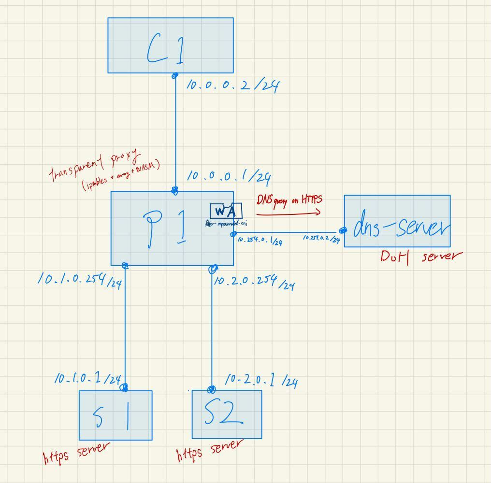

# example

## requirements

* install Docker & [tinet](https://github.com/tinynetwork/tinet)
* install cargo to build Proxy-Wasm binary
* checked environment: Linux 3.10.0-1160.119.1.el7.x86_64

## network



## build

```bash
make
tinet up | sudo sh -x
tinet conf | sudo sh -x
```

## test

```bash
tinet test | sudo sh -x
```

## cleanup

```bash
tinet down | sudo sh -x
```
